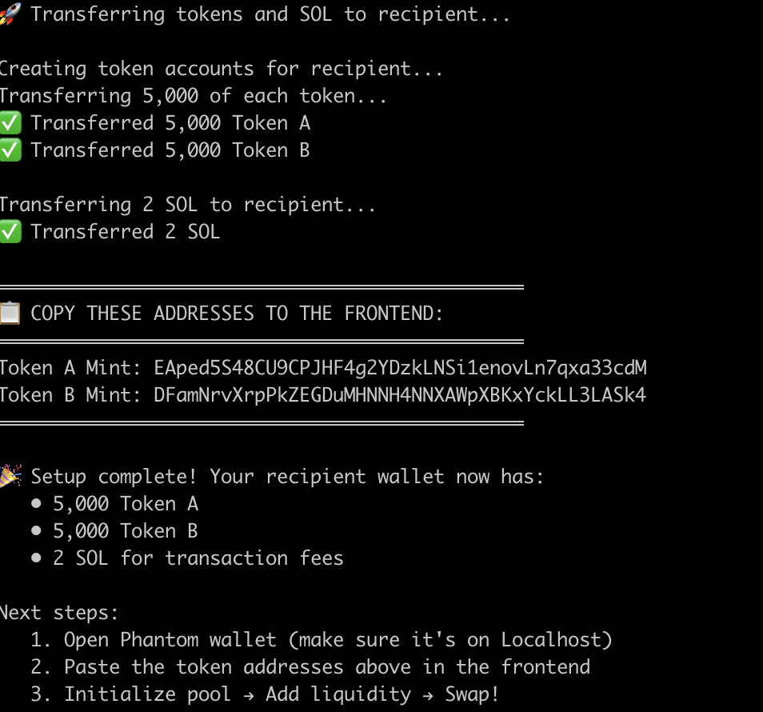
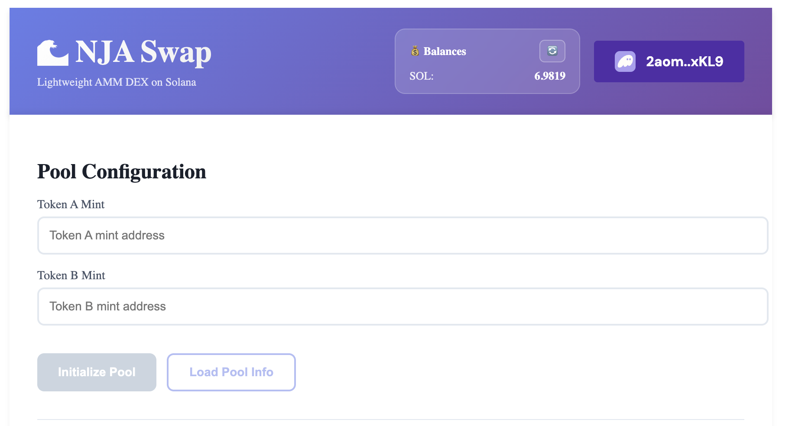
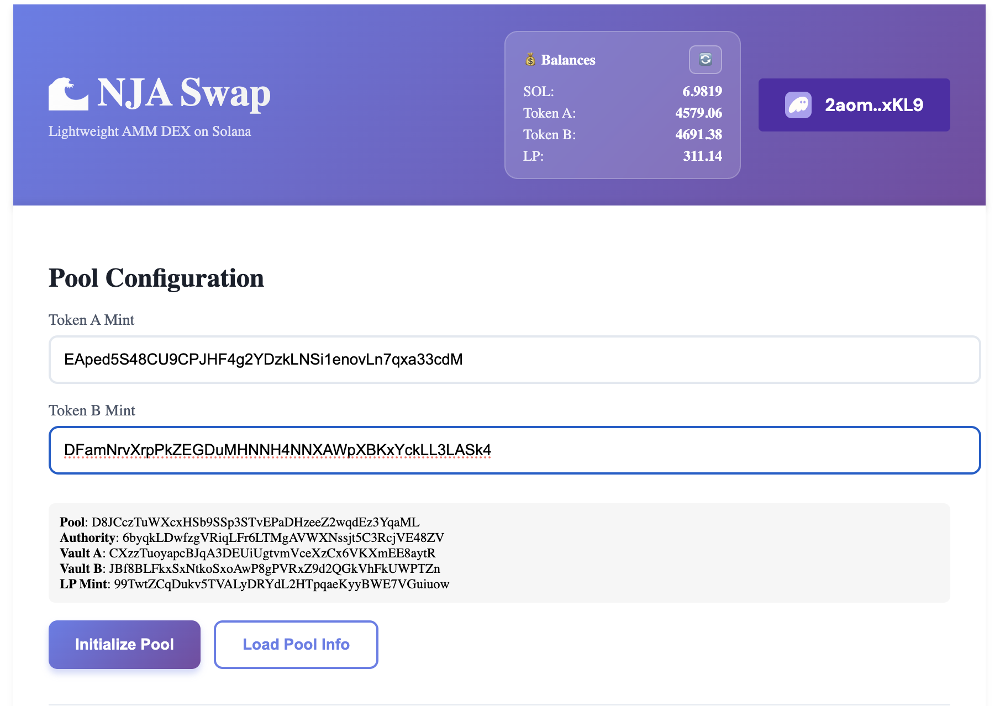
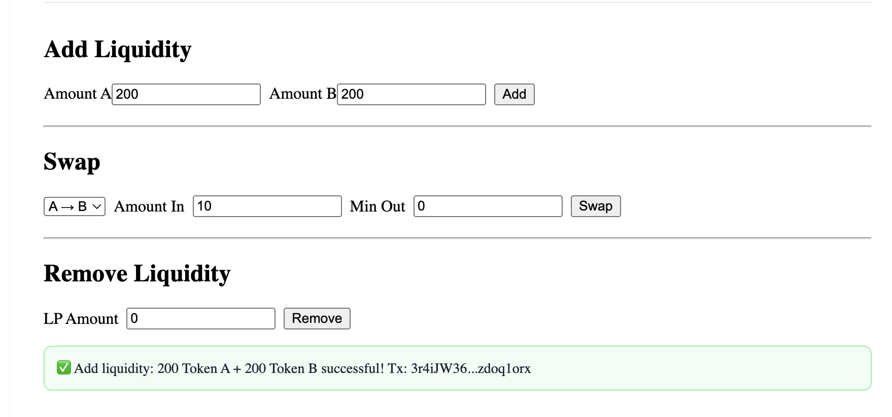
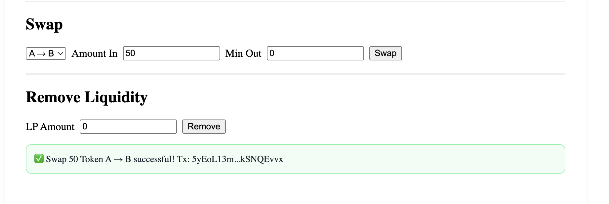
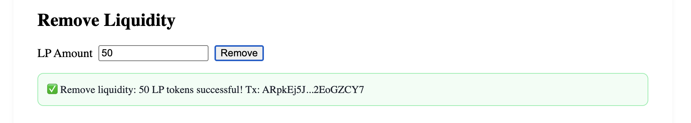

# 🎯 NJA Swap Demo Guide

A step-by-step visual walkthrough of using the NJA Swap DEX.

---

## 1️⃣ Setup Test Tokens

Run the setup script to create test tokens and fund your wallet:

```bash
yarn setup-tokens <YOUR_PHANTOM_ADDRESS>
```



**What happens:**
- Creates Token A and Token B mints
- Mints 10,000 of each token to CLI wallet
- Transfers 5,000 of each + 2 SOL to your Phantom wallet
- Prints token mint addresses to copy

---

## 2️⃣ Connect Wallet

Open http://localhost:3000 and connect your Phantom wallet.



**Make sure:**
- Phantom is on **Localhost** network
- You see your SOL balance in the top-right corner
- Balance card shows with 🔄 refresh button

---

## 3️⃣ Initialize or Load Pool

Paste the Token A and Token B mint addresses, then initialize the pool.



**Steps:**
1. Paste Token A mint address
2. Paste Token B mint address
3. See pool PDAs displayed below
4. Click **Initialize Pool** (first time only)
5. Click **Load Pool Info** to see reserves

---

## 4️⃣ Add Liquidity

Provide liquidity to the pool to enable trading.



**How it works:**
1. Enter amounts (default: 100 each)
2. Click **Add**
3. Approve transaction in Phantom
4. See success message with operation details
5. Receive LP tokens (check balance card)

**Note:** First deposit must satisfy `sqrt(amount_a × amount_b) > 1000`

---

## 5️⃣ Swap Tokens

Trade tokens using the AMM pricing.



**Steps:**
1. Select direction (A → B or B → A)
2. Enter amount to swap
3. Set minimum output (slippage protection)
4. Click **Swap**
5. Balances auto-refresh after success

**How pricing works:**
- Uses constant product formula: `x × y = k`
- Price adjusts based on pool reserves
- 0.3% fee goes to liquidity providers

---

## 6️⃣ Remove Liquidity

Withdraw your funds by burning LP tokens.



**Steps:**
1. Enter LP token amount to burn
2. Click **Remove**
3. Receive proportional Token A + Token B
4. Includes your share of accumulated fees

---

## 💡 Tips

**Status Messages:**
- 🟢 Green = Success
- 🔴 Red = Error
- 🟡 Yellow = Processing

**Balances:**
- Auto-load when you connect wallet
- Click 🔄 to refresh after transactions
- Shows SOL, Token A, Token B, and LP tokens

**Troubleshooting:**
- No liquidity error? Add liquidity first
- Account not found? Tokens will auto-create on first use
- Transaction failed? Check you have enough SOL for fees

---

**Built by Team NJA (#13)** · Solana Bootcamp 2025
